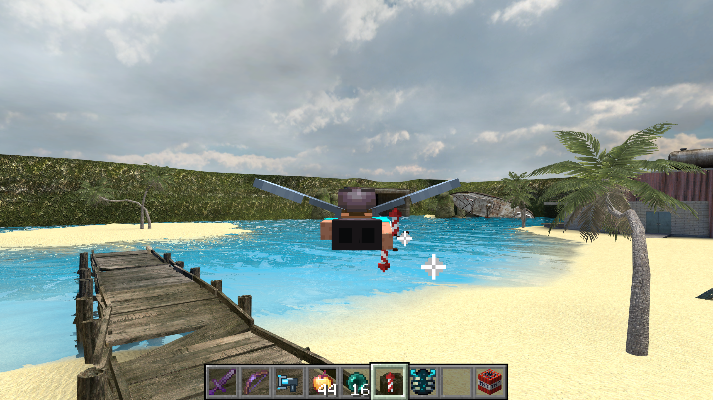

# GarryCraft

Minecraft gameplay inside Garry's Mod. Minecraft handles movement, blocks, inventory, and mobs. Garry's Mod supplies maps, props, NPCs, and rendering.



## Install V1

**Windows x64 and 64-bit Garry's Mod are required. Single-player only.**
Own Garry's Mod and Minecraft Java Edition. Setup downloads Minecraft Java 26.3, Fabric, and a private Java 25 runtime.
You do not need build tools, a separate Java installation, or PowerShell 7.

1. In Steam, open **Garry's Mod > Properties > Betas**.
2. Select **x86-64** under **Beta Participation**, then wait for the update.
3. Close Garry's Mod.
4. Download **GarryCraft-1.0.1-windows-x64.zip** from [the latest release](https://github.com/PeytonWDYM/GarryCraft/releases/latest).
5. Extract the entire ZIP into a folder.
6. Open **Install.cmd**.
7. After setup completes, open the printed **Play.cmd** path.
8. Select **Start New Game > Sandbox > any map > Single Player**.

Setup finds Garry's Mod in your Steam libraries and installs GarryCraft.
If asked for the game folder, use Steam's **Properties > Installed Files > Browse** and paste that path.

Minecraft gets its own installation and required mods at `%LOCALAPPDATA%\GarryCraft\player`.
Your existing Minecraft installation stays separate. Your enabled GMod addons load as usual.

Setup stops if your GMod engine build is unsupported. Steam updates can require a new GarryCraft release.
See [installation help](docs/INSTALL.md) for fixes, logs, and manual installation.

Minecraft starts when you load a map. Each map keeps a separate Minecraft world.
Use **Spawn Menu > Utilities > GarryCraft**, or `garrycraft_menu`, to enable or disable the bridge.

From a source checkout, `Install.cmd` downloads and runs the matching compiled release installer automatically.

## Current limits

V1 targets local Windows x64 Sandbox play. Other maps, game modes, and addons need separate compatibility tests.
Physics and rendering have known limits. Source lighting does not reproduce Minecraft lighting.
Read [feature coverage](PARITY.md) and [architecture](docs/ARCHITECTURE.md) before reporting compatibility or complete physics parity.

## Development

Read [AGENTS.md](AGENTS.md) for contributor and coding-agent instructions.
Development requires JDK 25, PowerShell 7, Visual Studio 2022 C++ tools, and CMake.
Use a separate GMod installation with a `.garrycraft-lab` marker.

```powershell
.\tools\Build.ps1
.\tools\Setup-Lab.ps1 -LabPath "$env:LOCALAPPDATA\GarryCraft\gmod-lab"
```

Keep generated game files, account data, logs, and test worlds outside tracked source.
See [release packaging](docs/RELEASING.md) and [installer scenarios](tests/release-install.md).

The bridge builds on [SkyCraft](https://github.com/chasmlol/SkyCraft).
[Protocol](protocol/README.md) · [Change log](MODLOG.md) · [Third-party notices](THIRD_PARTY_NOTICES.md)
